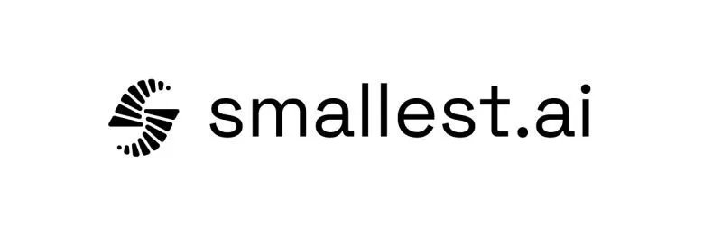

# MiniFlow



<p align="center">
  Voice-to-text dictation and command assistant for macOS.
</p>
<p align="center">
  Hold Fn to speak and MiniFlow types at your cursor using the fastest and most accurate speech-to-text model in the world.
</p>

<p align="center">
  <a href="https://www.apple.com/macos/">
    
  </a>
  <a href="LICENSE">
    
  </a>
</p>


## Features

- Global Fn hold-to-talk for instant dictation
- Automatic typing at your cursor with no copy/paste steps
- Clean MVP build (no external integrations)

## Prerequisites

- macOS Ventura 13.0 or later
- Apple Silicon (arm64)
- Smallest AI API key

## Quick start

1. Download the latest DMG and drag MiniFlow.app to Applications.
2. Clear Gatekeeper and launch:

```bash
xattr -cr /Applications/MiniFlow.app && open /Applications/MiniFlow.app
```

3. Grant Microphone and Accessibility permissions when prompted.
4. Open Settings and add your Smallest AI API key.

Keys are stored locally in `~/miniflow/miniflow_keys.json`.

## Usage

- Hold Fn to start speaking
- Release Fn to stop 

## Building from source

```bash
# 1. Clone
git clone https://github.com/your-org/miniflow.git
cd miniflow

# 2. Install Python deps
cd miniflow-engine && pip install -r requirements.txt && cd ..

# 3. Build everything (backend + app + DMG)
./build_all.sh
```

Output: `build/MiniFlow-0.2.0.dmg`

## Project structure

```
MiniflowApp/       # Swift/SwiftUI macOS app
miniflow-engine/   # Python FastAPI engine
miniflow-auth/     # OAuth helpers (disabled in MVP)
```

## Troubleshooting

- Fn key not working: enable Accessibility in System Settings.
- No transcription: check Microphone permission and API key.
- Engine failed to start: wait a few seconds after first launch and retry.

Logs:

```bash
tail -f ~/miniflow/miniflow.log
```

## License

MIT. See LICENSE.
